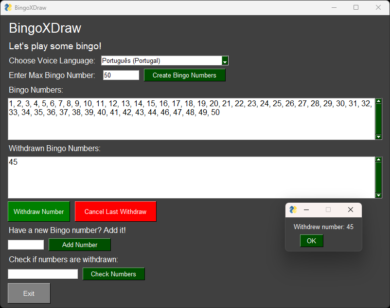

# BingoXDraw

**BingoXDraw** is a Python-based bingo number management application that allows users to simulate a bingo game with various interactive features. Built using the PySimpleGUI library for an intuitive graphical user interface (GUI) and the pygame library for sound effects, this application offers the following capabilities:

- **Set Maximum Bingo Number**: Define the upper limit for the bingo number range.
- **Withdraw Bingo Numbers**: Randomly withdraw bingo numbers and play corresponding sound effects, with voice announcements using Azure Cognitive Services Speech API.
- **Cancel Last Withdrawal**: Undo the most recent withdrawal with a confirmation prompt and a sound alert.
- **Add New Numbers**: Dynamically add new numbers to the bingo pool.
- **Check Bingo**: Verify if a specific set of numbers forms a bingo by checking against withdrawn numbers, with success or failure sound notifications.
- **Persistent Data Storage**: The state of the bingo numbers and withdrawals is saved to a file, ensuring no data is lost between sessions even in case of unexpected app closures.

Featuring **Christmas-inspired sound effects**, the game adds a festive touch to the bingo experience. From jingles to celebratory win sounds, the sound design enhances the holiday atmosphere, making the game more fun and immersive.

The app is designed for both casual and serious bingo players, offering a variety of interactive features with a fun and engaging user experience. The voice language for announcements is customizable, with a selection of languages and voices powered by Azure Text-to-Speech service, making the game more accessible and enjoyable for players around the world.


## 📐 How to Install
You can create a conda environment and install the packages from requirements.txt:
```shell
conda activate <your_env_name>

pip install -r requirements.txt
```
Create secrets.env file with the SPEECH_KEY and SPEECH_REGION and put it on the user_files folder in case you want to use the Azure Speech voices feature.

## 🎮 How to run
To run the application one can execute the following script:
```shell
python bingo_ui.py
```
Or execute the bingo_ui_nb.ipynb notebook.


### 🖼️ UI example of withdrawing a number




## ⚖️ LICENSE
MIT License