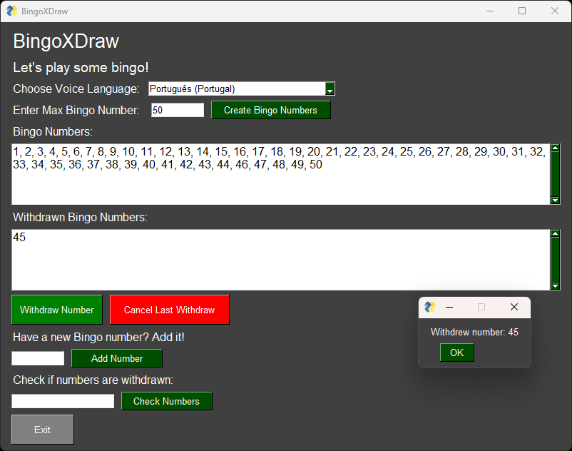

# BingoXDraw

**BingoXDraw** is a Python-based bingo number management application that allows users to simulate a bingo game with various interactive features. Built using the PySimpleGUI library for an intuitive graphical user interface (GUI) and the pygame library for sound effects, this application offers the following capabilities:

- **Set Maximum Bingo Number**: Define the upper limit for the bingo number range.
- **Withdraw Bingo Numbers**: Randomly withdraw bingo numbers and play corresponding sound effects, with voice announcements using Azure Speech Service, Google Text-to-Speech, or local eSpeak.
- **Flexible Text-to-Speech**: Choose between **Azure Speech Service** (premium voices, requires credentials), **Google Text-to-Speech** (free, online), or **Local eSpeak** (free, offline) for voice announcements.
- **Cancel Last Withdrawal**: Undo the most recent withdrawal with a confirmation prompt and a sound alert.
- **Add New Numbers**: Dynamically add new numbers to the bingo pool.
- **Check Bingo**: Verify if a specific set of numbers forms a bingo by checking against withdrawn numbers, with success or failure sound notifications.
- **Persistent Data Storage**: The state of the bingo numbers and withdrawals is saved to a file, ensuring no data is lost between sessions even in case of unexpected app closures.

Featuring **Christmas-inspired sound effects**, the game adds a festive touch to the bingo experience. From jingles to celebratory win sounds, the sound design enhances the holiday atmosphere, making the game more fun and immersive.

The app is designed for both casual and serious bingo players, offering a variety of interactive features with a fun and engaging user experience. The voice language for announcements is customizable, with support for 12+ languages and voices, making the game more accessible and enjoyable for players around the world.


## 🔊 Text-to-Speech Options

BingoXDraw now supports three TTS providers:

### Azure Speech Service (Premium)
- High-quality, natural-sounding voices
- Supports advanced speech customization
- Requires Azure Speech API credentials
- Requires internet connection

### Google Text-to-Speech (Free, Online)
- No setup required
- Works out-of-the-box
- Requires internet connection
- Good quality synthesis

### Local (eSpeak) - Offline
- Works completely offline - no internet needed
- No API credentials required
- Available on all platforms (Windows, macOS, Linux, WSL)
- Slightly lower audio quality than cloud services
- Requires eSpeak installation on some systems (pre-installed on Windows, optional on macOS/Linux/WSL)

All three providers support the same 12+ languages and can be switched seamlessly.


## 📐 How to Install

### Standard Installation
Create a virtual environment and install dependencies:
```shell
python3 -m venv .venv
source .venv/bin/activate  # On Windows: .venv\Scripts\activate
pip install -r requirements.txt
```

### Optional: Azure Speech Setup
To use Azure Speech Service for premium voice quality:

1. Create a `secrets.env` file in the `user_files` folder
2. Add your Azure Speech credentials:
```env
SPEECH_KEY=your_azure_speech_key
SPEECH_REGION=your_azure_speech_region
```

If Azure credentials are not provided, the app will automatically use Google Text-to-Speech (gTTS).

### Optional: Local (eSpeak) Setup (for offline TTS)
For completely offline text-to-speech without internet:

**Windows**: eSpeak is typically pre-installed. If not, download from http://espeak.sourceforge.net/

**Linux/WSL**: Install via apt:
```bash
sudo apt-get install espeak-ng
```

Once installed, you can select "Local (eSpeak)" in the GUI for offline operation.

### Optional: PulseAudio Setup (for WSL audio output)
If you're using WSL and want audio output from text-to-speech announcements:

```bash
sudo apt-get update
sudo apt-get install pulseaudio
pulseaudio --start
```

Note: Audio output is optional - text-to-speech synthesis works fine without it. PulseAudio is only needed if you want to hear the audio announcements in WSL.

## 🎮 How to Run
To run the application, execute:
```shell
python bingo_ui.py
```
Or execute the `bingo_ui_nb.ipynb` notebook.


## 🧪 Testing

The project includes comprehensive unit tests and edge case tests using pytest.

### Run Tests
```shell
pytest tests/
```

### Run Tests with Coverage Report
To run tests with coverage analysis:
```shell
coverage run -m pytest tests/
coverage report -m
```


### 🖼️ UI Example of Withdrawing a Number




## ⚖️ LICENSE
MIT License